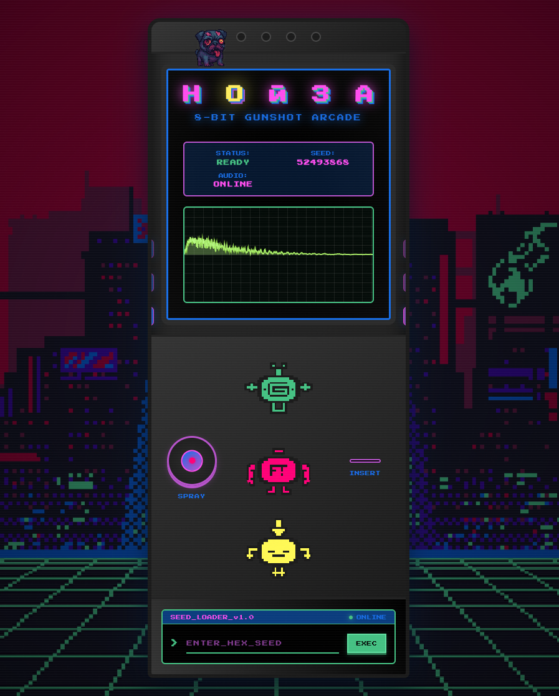
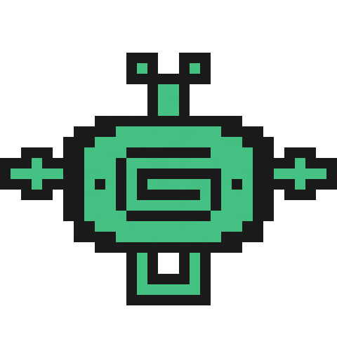
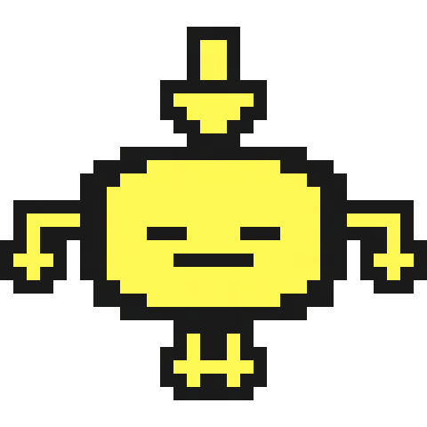

<div align="center">


# BITGUN

[](https://bxavaby.github.io/bitgun)
[](LICENSE)
[](https://developer.mozilla.org/en-US/docs/Web/API/Web_Audio_API)

**Procedural 8-bit gunshot sound generator**



────

**Infinite variation** • **No samples** • **Seed-based generation**

────

## Pixel Art Controls

<div align="center">



*Generate new random gunshot sounds*


*Play the current sound effect*



*Download as WAV file*

</div>

────

## Features


## How It Works

Pure Web Audio API synthesis using oscillators, envelope shaping, and bitcrushing. Each sound gets a unique hex seed for reproducible generation.

## Usage


## Development

```bash
git clone https://github.com/bxavaby/bitgun.git
```

<sub>*Responsiveness varies by device. Feel free to [request improvements](https://github.com/bxavaby/bitgun/issues) for your setup.*</sub>

**MIT License © 2025 bxavaby**

</div>
