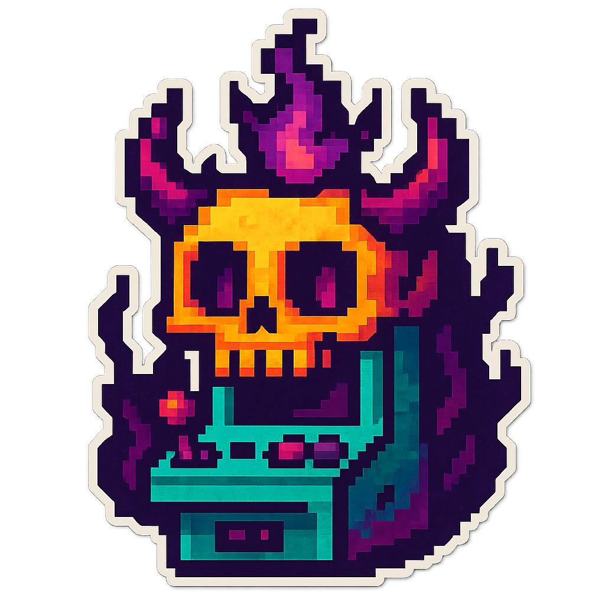

<div align="center">



# BITGUN

[](https://bxavaby.github.io/bitgun)
[](LICENSE)
[](https://developer.mozilla.org/en-US/docs/Web/API/Web_Audio_API)

**Procedural 8-bit gunshot sound generator**


────

**Infinite variation** • **No samples** • **Seed-based generation**

────

## Pixel Art Controls

<div align="center">


*Generate new random gunshot sounds*


*Play the current sound effect*


*Download as WAV file*

</div>

────

## Features


- **Zero samples** – Pure algorithmic synthesis
- **Infinite sounds** – Never hear the same gunshot twice
- **Hex seeds** – Share and recreate specific sounds
- **Instant export** – Download game-ready WAV files
- **Arcade vibes** – Retro pixel art interface

## How It Works

BITGUN uses Web Audio API magic to synthesize 8-bit gunshot sounds in real-time through oscillators, envelope shaping, frequency modulation, and bitcrushing effects. Each sound gets a unique 8-character hex seed for reproducible generation.

## Usage

- **F key** or click Fire button to play
- **Spacebar** to focus seed input
- Enter custom hex seeds in the terminal
- Export includes seed in the filename

## Development

```bash
git clone https://github.com/bxavaby/bitgun.git
# open index.html in the browser
```

<sub>*Responsiveness varies by device. Feel free to [request improvements](https://github.com/bxavaby/bitgun/issues) for your setup.*</sub>

**MIT License © 2025 bxavaby**

</div>
